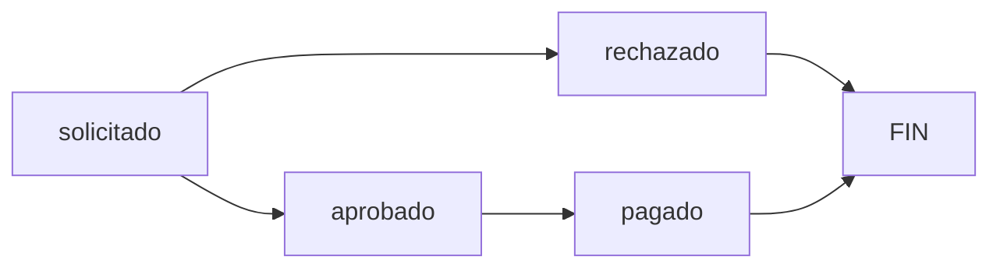

# Sistema de Auxilios Póstumos

## Descripción General

Sistema completo para la gestión de auxilios póstumos que incluye:
- Búsqueda de cuentas vigentes
- Verificación de renovaciones activas
- Solicitud de auxilios
- Gestión de documentos
- Aprobación/Rechazo de solicitudes
- Registro de pagos
- Historial completo

## Flujo del Proceso

### 1. Búsqueda de Cuenta (Estado: Inicial)

**Endpoint:** `GET /api/seguros/auxilios/buscar-cuentas?q={busqueda}`

El proceso inicia buscando la cuenta del asegurado fallecido:
- Busca por nombre o cédula (mínimo 3 caracteres)
- Solo muestra cuentas con estado "vigente"
- Verifica si existe renovación vigente actual
- Muestra beneficiarios registrados

**Respuesta:**
```json
{
  "status": 1,
  "data": [{
    "id": 1,
    "cliente": {
      "nombre": "Juan Pérez",
      "cedula": "001-1234567-8"
    },
    "servicio": {
      "nombre": "Plan Básico",
      "monto_auxilio": 50000.00
    },
    "renovacion_vigente": {
      "fecha_fin": "2026-12-31",
      "monto": 1200.00
    },
    "beneficiarios": [...]
  }]
}
```

### 2. Verificación de Renovación (Estado: Validación)

**Endpoint:** `POST /api/seguros/auxilios/verificar-renovacion`

Al seleccionar una cuenta e ingresar la fecha de fallecimiento:
- Verifica que exista una renovación vigente en esa fecha específica
- La renovación debe tener `estado = 'vigente'`
- La fecha de fallecimiento debe estar entre `fecha_inicio` y `fecha_fin`
- Si es válida, devuelve el monto aprobado automáticamente

**Request:**
```json
{
  "id_cuenta": 1,
  "fecha_fallece": "2026-01-05"
}
```

**Respuesta (Exitosa):**
```json
{
  "status": 1,
  "vigente": true,
  "monto_aprobado": 50000.00,
  "renovacion_id": 5
}
```

### 3. Creación de Solicitud (Estado: solicitado)

**Endpoint:** `POST /api/seguros/auxilios`

Cuando la renovación es válida, se puede crear la solicitud:

**Request (FormData):**
```
id_cuenta: 1
id_beneficiario: 15
fecha_fallece: 2026-01-05
fecha_solicitud: 2026-01-10
monto_aprobado: 50000.00
notas: "Fallecimiento por enfermedad"
documentos[0]: [archivo.pdf]
documentos[1]: [acta_defuncion.pdf]
```

**Validaciones:**
- Cuenta debe estar vigente
- Renovación vigente en fecha de fallecimiento
- Beneficiario debe pertenecer a la cuenta
- Documentos son opcionales pero recomendados

**Estado inicial:** `solicitado`

**Respuesta:**
```json
{
  "status": 1,
  "id": 25,
  "estado": "solicitado"
}
```

### 4. Listar Solicitudes Pendientes

**Endpoint:** `GET /api/seguros/auxilios/listar?estado=solicitado`

Obtiene todas las solicitudes pendientes de aprobación con toda su información relacionada.

### 5. Aprobación de Solicitud (Estado: aprobado)

**Endpoint:** `PUT /api/seguros/auxilios/{id}/aprobar`

Cambio de estado de `solicitado` → `aprobado`

**Validaciones:**
- Solo se pueden aprobar auxilios en estado "solicitado"
- Registra quién aprobó (`updated_by`)

**Respuesta:**
```json
{
  "status": 1,
  "id": 25,
  "estado": "aprobado"
}
```

### 6. Rechazo de Solicitud (Estado: rechazado)

**Endpoint:** `PUT /api/seguros/auxilios/{id}/rechazar`

Cambio de estado de `solicitado` → `rechazado`

**Request:**
```json
{
  "motivo": "Documentación incompleta"
}
```

El motivo se agrega a las notas del auxilio con prefijo "RECHAZADO:"

### 7. Registro de Pago (Estado: pagado)

**Endpoint:** `POST /api/seguros/auxilios/{id}/pagar`

Una vez aprobado, se registra el pago:

**Request:**
```json
{
  "fecha": "2026-01-15",
  "monto": 50000.00,
  "forma_pago": "transferencia",
  "numdoc": "TRANS-12345",
  "id_ctbbanco": 3,
  "banco_numdoc": "REF-789",
  "banco_fecha": "2026-01-15"
}
```

**Formas de pago:**
- `efectivo`
- `transferencia`
- `cheque`

**Proceso:**
1. Crea registro en tabla `aux_auxilios_pagos`
2. Cambia estado del auxilio a `pagado`
3. Registra quién realizó el pago

### 8. Historial

**Endpoint:** `GET /api/seguros/auxilios/historial?estado={filtro}`

Muestra auxilios completados (pagados o rechazados)

**Filtros opcionales:**
- `estado=pagado` - Solo pagados
- `estado=rechazado` - Solo rechazados
- Sin filtro - Todos los finalizados

## Estados del Auxilio



1. **solicitado** - Solicitud creada, pendiente de revisión
2. **aprobado** - Solicitud aprobada, pendiente de pago
3. **rechazado** - Solicitud rechazada (estado final)
4. **pagado** - Pago registrado (estado final)

## Tablas Involucradas

### aux_auxilios (Principal)
- `id` - ID del auxilio
- `id_cuenta` - Cuenta del seguro
- `id_beneficiario` - Beneficiario que recibirá el auxilio
- `fecha_fallece` - Fecha de fallecimiento
- `fecha_solicitud` - Fecha de la solicitud
- `monto_aprobado` - Monto a pagar
- `estado` - Estado actual (solicitado/aprobado/rechazado/pagado)
- `notas` - Observaciones
- `created_by` / `updated_by` / `deleted_by` - Auditoría

### aux_auxilios_pagos
- `id_auxilio` - Relación con auxilio
- `fecha` - Fecha del pago
- `monto` - Monto pagado
- `forma_pago` - Tipo de pago
- `numdoc` - Número de documento
- `id_ctbbanco` - Cuenta bancaria utilizada
- `banco_numdoc` / `banco_fecha` - Referencias bancarias

### aux_documentos
- `id_auxilio` - Relación con auxilio
- `descripcion` - Nombre del documento
- `ruta` - Ruta del archivo guardado

## Validaciones Importantes

### Renovación Vigente
La validación más crítica es verificar que exista una renovación vigente en la fecha de fallecimiento:

```php
$renovacion = Renovacion::where('id_cuenta', $id_cuenta)
    ->where('estado', 'vigente')
    ->where('fecha_inicio', '<=', $fecha_fallece)
    ->where('fecha_fin', '>=', $fecha_fallece)
    ->first();
```

**Sin renovación vigente = NO se puede procesar el auxilio**

### Beneficiarios
- Debe estar registrado en `aux_beneficiarios`
- Relación many-to-many con la cuenta
- Incluye parentesco y porcentaje

### Documentos
Los archivos se guardan en:
```
/public/uploads/auxilios/{id_auxilio}/
```

Tipos permitidos: PDF, JPG, PNG

## Interfaz de Usuario

### Tabs Principales

1. **🔍 Buscar Cuenta**
   - Input de búsqueda
   - Resultados con información completa
   - Botón "Crear Solicitud"

2. **📋 Solicitudes Pendientes**
   - Lista de auxilios en estado "solicitado"
   - Botones: Aprobar / Rechazar / Ver Detalle

3. **✅ Aprobadas**
   - Auxilios aprobados pendientes de pago
   - Botón "Registrar Pago"

4. **📊 Historial**
   - Tabla con todos los auxilios finalizados
   - Filtros por estado

### Modales

1. **Modal de Solicitud**
   - Datos del asegurado
   - Fecha de fallecimiento
   - Verificación de renovación
   - Selección de beneficiario
   - Subida de documentos
   - Notas

2. **Modal de Pago**
   - Resumen del auxilio
   - Datos del pago
   - Forma de pago
   - Referencias bancarias

## Seguridad

- Todas las rutas POST/PUT requieren CSRF token
- Validación de estados antes de cada operación
- Auditoría completa con `created_by` / `updated_by`
- Soft deletes en auxilios
- Validación de archivos subidos

## Ejemplo de Uso Completo

```javascript
// 1. Buscar cuenta
const cuentas = await fetch('/api/seguros/auxilios/buscar-cuentas?q=Juan');

// 2. Verificar renovación
const verificacion = await fetch('/api/seguros/auxilios/verificar-renovacion', {
  method: 'POST',
  body: JSON.stringify({
    id_cuenta: 1,
    fecha_fallece: '2026-01-05'
  })
});

// 3. Crear solicitud
const formData = new FormData();
formData.append('id_cuenta', 1);
formData.append('id_beneficiario', 15);
formData.append('fecha_fallece', '2026-01-05');
// ... más campos y documentos

const solicitud = await fetch('/api/seguros/auxilios', {
  method: 'POST',
  body: formData
});

// 4. Aprobar
await fetch('/api/seguros/auxilios/25/aprobar', { method: 'PUT' });

// 5. Registrar pago
await fetch('/api/seguros/auxilios/25/pagar', {
  method: 'POST',
  body: JSON.stringify({
    fecha: '2026-01-15',
    monto: 50000,
    forma_pago: 'transferencia'
  })
});
```

## Mejoras Futuras

1. **Notificaciones**
   - Email al beneficiario cuando se aprueba
   - Email cuando se realiza el pago

2. **Reportes**
   - Reporte de auxilios pagados por período
   - Estadísticas de tiempos de procesamiento

3. **Workflow**
   - Múltiples niveles de aprobación
   - Comentarios y seguimiento

4. **Integración**
   - Conexión con sistema contable
   - Generación automática de comprobantes
